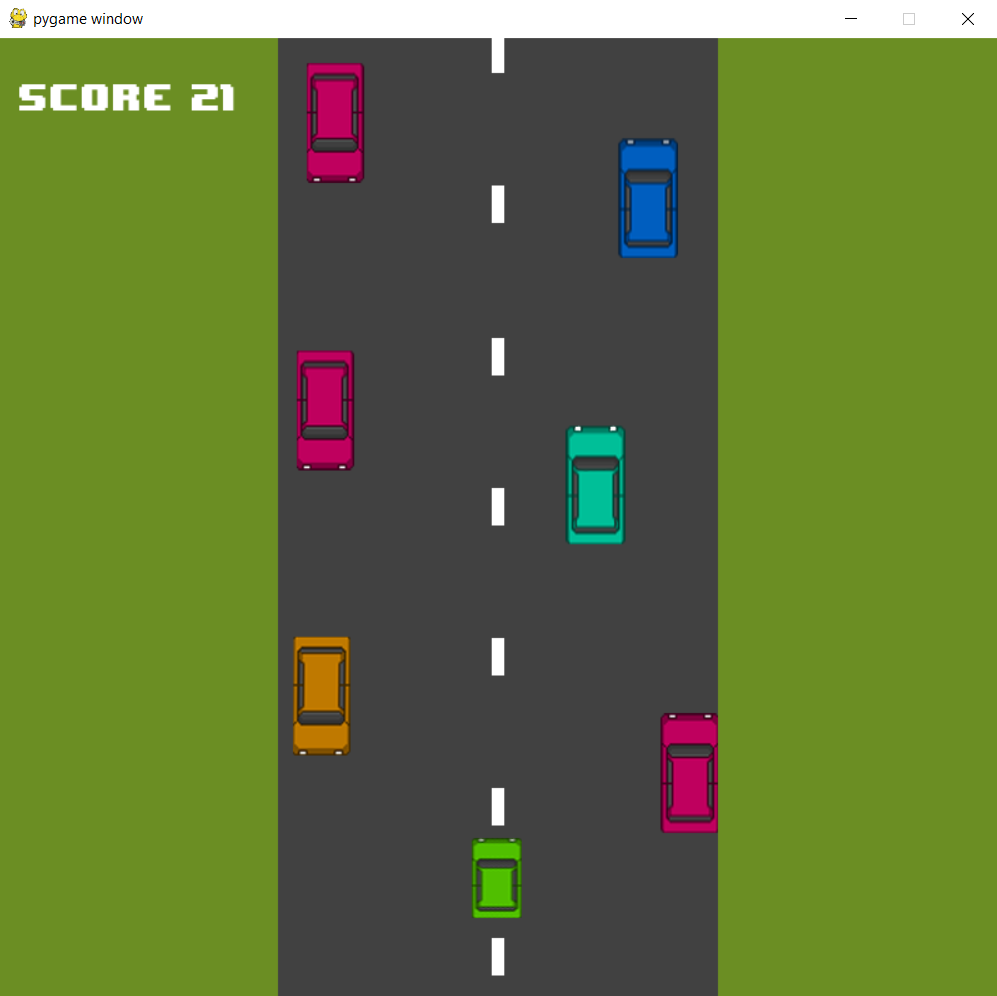
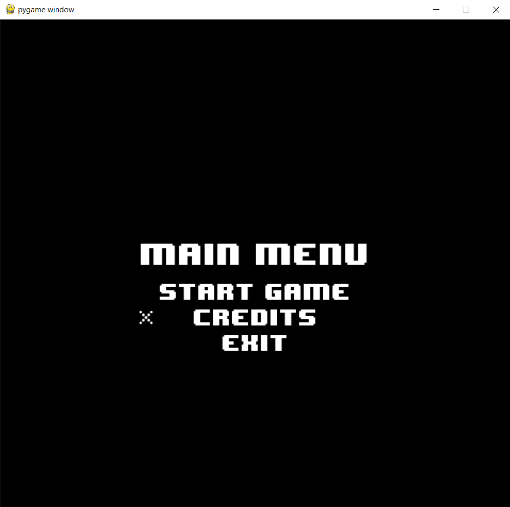

# Race game

Highway Racer is game where you take on the role of driver maneuvering through traffic on a busy highway. Your goal is to zigzag through incoming and outgoing vehicles to score points and reach the highest possible score.



## Gameplay 

In Highway Racer, you will navigate a fast-paced highway filled with cars coming towards you and others driving in the same direction. Your challenge is to dodge these vehicles by intuitive controls.

## Installing

1. Clone git repository:
```
$ git clone https://github.com/Vladislav-Sharapa/race-game
```
2. Create virtual enviroment using following command:

```
$ python -m venv venv
```
3. Install Python packages specified in the 'requirements.txt':
```
$ pip install -r requirements.txt
```
> :heavy_exclamation_mark: Before running this command, make sure your virtual environment has been activated

## Getting started

To start the game run the script "main.py":
```
$ python main.py
```

## Controls 

### Car control

- **A**: move to the left
- **D**: move to the right

### Navigation

- **:arrow_up:**: move point up 
- **:arrow_down:**: move point down
- **Enter**: select point

